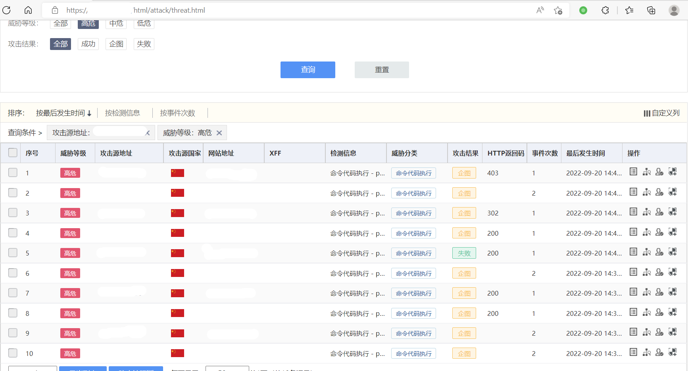
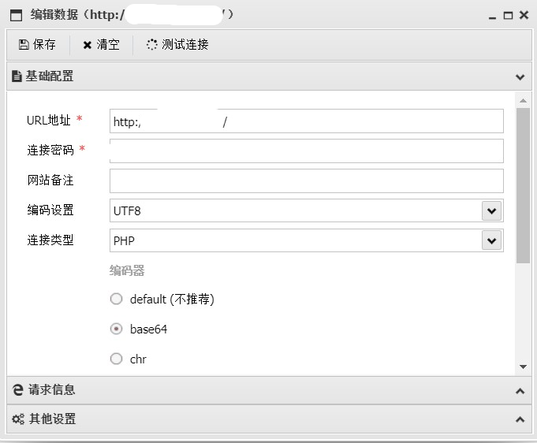
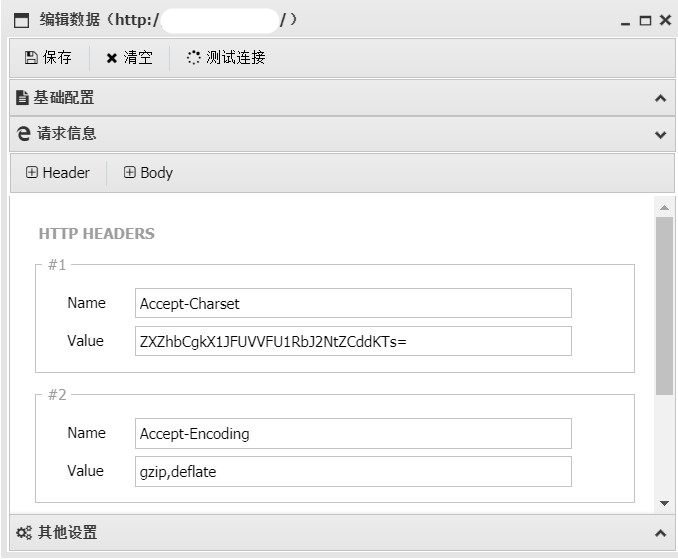
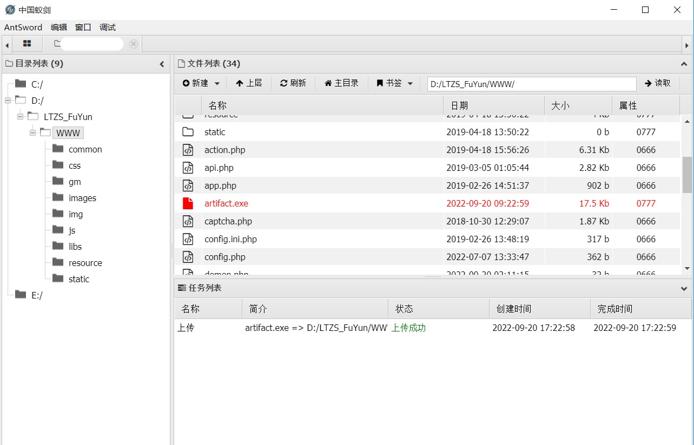
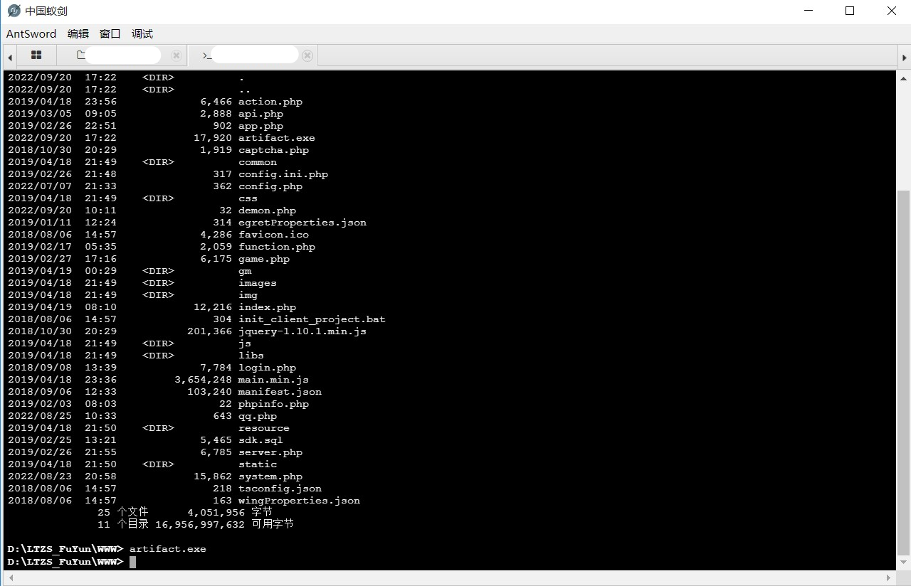
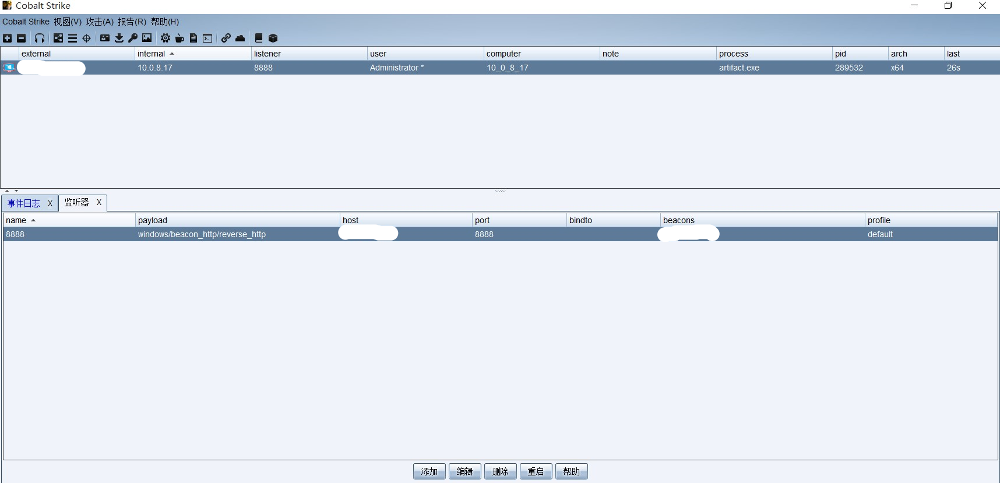
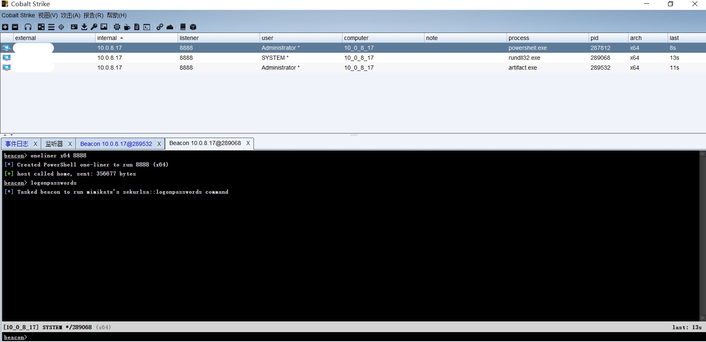

> **流量监测设备发现入侵事件**

流量监测设备发现某IP存在高危攻击事件，开始对此IP进行反制溯源

> **Xray进行漏洞探测**

使用xray对恶意IP进行漏洞探测，发现存在`phpstudy-backdoor-rce`漏洞

> **AntSword连接Webshell**

1. 配置蚁剑连接，编解码器使用`base64`

2. 利用漏洞进行无文件webshell连接，webshell直接写入请求头参数`Accept-Charset`

> **CobaltStrike进行getshell**

1. 上传后门文件artifact.exe

2. 蚁剑静态终端执行后门文件上线CobaltStrike

3. 由于目标系统phpStudy服务以管理员账号运行，通过此漏洞上线直接获取目标服务器管理员权限

> **权限提升**

Powershell、进程注入获取系统权限并进行权限维持

